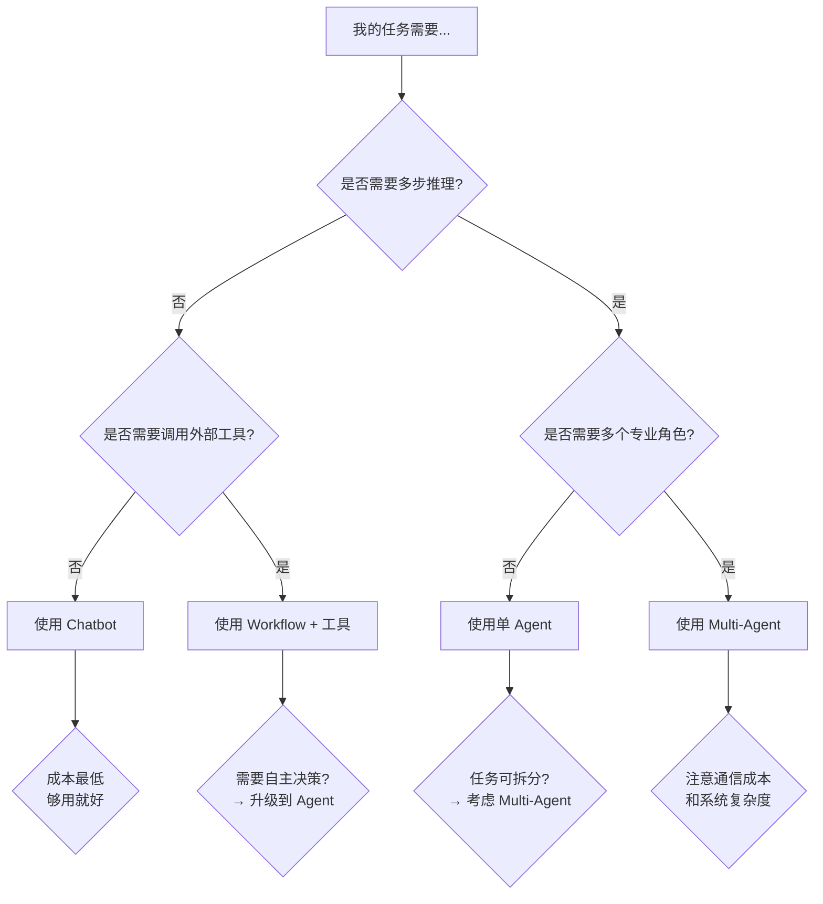

# 🤖 Chatbot vs Workflow vs Agent vs Multi-Agent 系统学习指南

> **学习路径起点**：在深入 Hello-Agents 项目之前，先理清这四个核心概念的区别与联系。
>
> 如果把 AI 应用的学习比作一座大厦：
> - **Chatbot** 是「一扇门」—— 最基础的入口
> - **Workflow** 是「楼梯」—— 预设好的固定路线
> - **Agent** 是「电梯」—— 能自主判断去哪一层
> - **Multi-Agent** 是「电梯群控系统」—— 多台电梯协同调度

---

## 📑 目录

1. [Chatbot（聊天机器人）](#1-chatbot聊天机器人)
2. [Workflow（工作流）](#2-workflow工作流)
3. [Agent（智能体）](#3-agent智能体)
4. [Multi-Agent（多智能体系统）](#4-multi-agent多智能体系统)
5. [四个概念的对比总结](#5-四个概念的对比总结)
6. [从 Hello-Agents 项目看这四者的演进](#6-从-hello-agents-项目看这四者的演进)

---

## 1️⃣ Chatbot（聊天机器人）

### 1.1 定义

**Chatbot（聊天机器人）** 是最基础的人机对话系统。它的核心是 **"一问一答"** —— 用户输入，它回复，没有复杂的内部状态管理，也没有自主决策能力。

### 1.2 核心特征

| 特征 | 说明 |
|------|------|
| 🎯 **被动响应** | 用户触发 → 模型回复，不会主动发起对话 |
| 📋 **无状态/短状态** | 通常只关注当前轮次对话，不维护长期上下文 |
| 🧠 **无推理能力** | 直接生成回复，不经历"思考-行动"的循环 |
| 🛠️ **无工具调用** | 仅凭模型自身知识回答，无法调用外部工具 |
| 🔄 **线性交互** | 每次对话独立，历史仅通过上下文窗口维持 |

### 1.3 技术实现

最简单的 Chatbot 就是一个 LLM API 调用的封装：

```python
from openai import OpenAI

class SimpleChatbot:
    def __init__(self, api_key, model="gpt-4"):
        self.client = OpenAI(api_key=api_key)
        self.model = model
        self.messages = []  # 简单的对话历史
    
    def chat(self, user_input):
        self.messages.append({"role": "user", "content": user_input})
        response = self.client.chat.completions.create(
            model=self.model,
            messages=self.messages
        )
        reply = response.choices[0].message.content
        self.messages.append({"role": "assistant", "content": reply})
        return reply
```

### 1.4 Hello-Agents 中的体现

在 [Chapter 1](../hello-agents/code/chapter1/FirstAgentTest.py) 中，第一个示例就是最基础的 Chatbot：

```python
# 最简单的LLM调用 —— 这就是Chatbot的雏形
from openai import OpenAI
client = OpenAI()
response = client.chat.completions.create(
    model="gpt-4",
    messages=[{"role": "user", "content": "你好"}]
)
print(response.choices[0].message.content)
```

### 1.5 适用场景

| ✅ 适合 | ❌ 不适合 |
|---------|----------|
| 简单客服问答 | 需要多步推理的复杂问题 |
| 闲聊陪伴 | 需要调用外部数据的任务 |
| 信息查询（模型已知） | 需要执行操作的场景 |
| 内容生成 | 需要跨 Session 记忆的任务 |

### 1.6 局限性

- **知识截止**：只能依赖训练数据，无法获取实时信息
- **无行动能力**：不能操作数据库、发邮件、调用 API
- **无推理规划**：没有"先查资料再回答"的中间步骤
- **无记忆持久化**：对话结束即遗忘（超上下文窗口后）

---

## 2️⃣ Workflow（工作流）

### 2.1 定义

**Workflow（工作流）** 是一种 **预定义的、结构化的任务执行流程**。它将一个复杂的任务拆解成一系列固定的步骤（节点），每个步骤执行特定的操作，步骤之间有明确定义的流转逻辑。

在 AI 语境下，Workflow 通常指 **"用 LLM 作为流程中的一个处理节点"**，但整个流程控制是由人类预先设计好的，LLM 只在特定节点发挥作用。

### 2.2 核心特征

| 特征 | 说明 |
|------|------|
| 📐 **预定义结构** | 流程由人类设计，节点和执行顺序固定 |
| 🔀 **有分支逻辑** | 支持 if/else、switch 等条件判断 |
| 🔗 **步骤依赖** | 下一步的输入依赖上一步的输出 |
| 🧩 **节点类型丰富** | 可包含 LLM 调用、代码执行、API 请求、人工审核 |
| 🎛️ **可编排** | 像搭积木一样组合不同模块 |

### 2.3 Workflow vs Pipeline

```
Pipeline（流水线）: A → B → C → D          （线性，无分支）
Workflow（工作流）:  A → B → C → D            （可以有条件判断、循环）
                    ↓        ↓
                   E → F    G → H
```

### 2.4 技术实现

下面是 Hello-Agents 中 [Chapter 9](../hello-agents/code/chapter9/06_three_day_workflow.py) 的工作流示例（简化版）：

```python
class Workflow:
    """一个简单的工作流引擎"""
    
    def __init__(self, steps: list):
        self.steps = steps  # 预定义的步骤列表
        self.context = {}   # 工作流共享上下文
    
    def run(self, initial_input):
        result = initial_input
        for step in self.steps:
            # 按预设顺序依次执行
            result = step.execute(result, self.context)
            if step.should_break(self.context):
                break  # 条件分支
        return result
```

### 2.5 常见 Workflow 模式

| 模式 | 描述 | 示例 |
|------|------|------|
| **链式（Chain）** | A→B→C 依次执行 | 翻译→润色→格式检查 |
| **路由（Router）** | 根据输入分派到不同分支 | 情感分析→分流到不同处理节点 |
| **并行扇出（Fan-out）** | 同时执行多个子任务 | 同时搜索、查数据库、调API |
| **聚合（Aggregator）** | 合并多个结果 | 汇总多渠道搜索结果 |
| **循环（Loop）** | 重复执行直到条件满足 | 持续优化输出直到质量达标 |
| **人机协同（Human-in-the-loop）** | 关键节点等待人工确认 | AI 生成→人工审核→最终输出 |

### 2.6 Hello-Agents 中的体现

**低代码平台 Workflow**（[Chapter 5](../hello-agents/code/chapter5/)）

Dify、Coze、n8n 本质上都是 Workflow 引擎——用户通过拖拽节点来编排 LLM 调用、工具使用、条件判断等：

```
输入 → LLM节点 → 代码节点 → 知识库检索 → 条件判断 → LLM节点 → 输出
                                              ↓
                                            人工审核节点 → 邮件发送
```

**DeepResearch 的工作流**（[Chapter 14](../hello-agents/code/chapter14/)）

```python
def run_research_workflow(topic):
    # 预设的固定流程
    todos = planner.plan(topic)           # 1️⃣ 规划研究任务
    for task in todos:                    
        results = search(task.query)      # 2️⃣ 执行搜索
        summary = summarize(results)      # 3️⃣ 总结搜索结果
    report = generate_report(todos)       # 4️⃣ 生成报告
    return report
```

### 2.7 适用场景

| ✅ 适合 | ❌ 不适合 |
|---------|----------|
| 业务流程明确的场景（如客服工单处理） | 需要自主探索的开放性问题 |
| 质量和一致性要求高的生产环境 | 任务路径不确定的场景 |
| 需要人工审核介入的场景 | 需要 Agent 自主决策的场景 |
| 文档处理、数据 ETL 等固定流程 | 高动态、非线性决策场景 |

### 2.8 Workflow vs Agent 的关键区别

```
Workflow: "人类告诉系统每一步怎么做"
Agent:    "人类告诉系统目标是什么，系统自己决定怎么做"
```

| 维度 | Workflow | Agent |
|------|----------|-------|
| 控制主体 | 人类 | LLM |
| 灵活性 | 低（固定路径） | 高（自主决策） |
| 可预测性 | 高 | 低 |
| 复杂度上限 | 受限于人类设计 | 理论上无上限 |
| 调试难度 | 低（流程透明） | 高（黑盒决策） |

---

## 3️⃣ Agent（智能体）

### 3.1 定义

**Agent（智能体）** 是一个 **能感知环境、自主决策、采取行动** 的智能系统。与 Chatbot 和 Workflow 不同，Agent 的核心是 **"自主性"**——它不只是被动回复，也不只是按固定流程执行，而是能够：

1. **理解目标**：接收一个高层次的任务描述
2. **规划步骤**：自主拆解任务，决定需要做什么
3. **使用工具**：调用搜索、计算器、数据库等外部工具
4. **推理行动**：通过"思考-行动-观察"循环逐步推进
5. **记忆学习**：维护短期和长期记忆，从经验中学习

### 3.2 核心特征

| 特征 | 说明 |
|------|------|
| 🤔 **推理能力** | 能进行多步思考（Chain-of-Thought） |
| 🎯 **目标驱动** | 理解抽象目标，自主规划实现路径 |
| 🛠️ **工具使用** | 调用外部工具扩展能力边界 |
| 🔄 **反馈循环** | 观察行动结果，调整下一步策略 |
| 🧠 **记忆系统** | 维护工作记忆、长期记忆 |
| 🔀 **自主决策** | 根据当前状态选择最优行动 |

### 3.3 Agent 的核心循环

```
                   ┌─────────────────┐
                   │   接收任务/目标   │
                   └────────┬────────┘
                            ↓
                   ┌─────────────────┐
                   │   感知/理解      │  ← 结合记忆和上下文
                   └────────┬────────┘
                            ↓
                   ┌─────────────────┐
             ┌────→│   思考(Thought)  │  ← 推理：下一步该做什么
             │     └────────┬────────┘
             │              ↓
             │     ┌─────────────────┐
             │     │   决策(Action)   │  ← 选择工具或给出答案
             │     └────────┬────────┘
             │              ↓
             │     ┌─────────────────┐
             │     │   执行/观察      │  ← 调用工具，获取结果
             │     └────────┬────────┘
             │              ↓
             │     ┌─────────────────┐
             └─────│   评估/反思      │──→ 任务完成 → 输出结果
                   └─────────────────┘
                        (继续循环)
```

### 3.4 三种经典范式（Hello-Agents Chapter 4）

#### 🅰 ReAct（推理 + 行动）

**核心思想**：将推理轨迹（Thought）和行动（Action）交织进行。

```python
# Chapter 4 ReAct 的核心逻辑
Thought: 用户问的是华为最新手机，我需要搜索一下
Action: Search[华为最新手机型号]
Observation: 华为 Mate 70 系列于 2024 年发布...
Thought: 现在我有了信息，可以回答问题了
Action: Finish[华为最新手机是 Mate 70 系列，主要卖点是...]
```

**伪代码**：
```python
class ReActAgent:
    def run(self, question):
        while steps < max_steps:
            # 1. 思考
            thought = self.think(question + history)
            # 2. 决定行动
            action = self.decide_action(thought)
            if action == "Finish":
                return action.result
            # 3. 执行并观察
            observation = execute_tool(action)
            # 4. 记录历史，继续循环
            history.append(f"Action: {action} → Observation: {observation}")
```

#### 🅱 Plan-and-Solve（先规划再执行）

**核心思想**：先生成完整计划，再逐步执行，与 ReAct 的"边想边做"形成对比。

```python
# Plan-and-Solve 的核心逻辑
Plan:
1. 搜索华为最新手机发布信息
2. 查找 Mate 70 系列的技术规格
3. 对比上一代产品升级点
4. 整理最终回答

Step 1: Search[华为2024最新手机发布]
Observation: 华为 Mate 70 系列于 10 月发布...
Step 2: Search[Mate 70 规格参数]
...
```

#### 🅒 Reflection（反思）

**核心思想**：Agent 生成输出后进行自我评估和修正。

```python
class ReflectionAgent:
    def run(self, task):
        # 第一轮：生成初步答案
        initial = self.generate(task)
        
        # 第二轮：自我反思，检查错误和不足
        feedback = self.evaluate(initial, task)
        
        # 第三轮：基于反馈改进
        improved = self.improve(initial, feedback)
        
        return improved
```

### 3.5 Agent 的工具系统

Agent 的能力边界由它的工具集决定。典型的工具包括：

| 工具类型 | 示例 | 解决什么问题 |
|----------|------|-------------|
| 🔍 **搜索工具** | SerpAPI, Bing Search | 突破知识截止，获取实时信息 |
| 🧮 **计算工具** | Calculator, Wolfram | 精确数学计算 |
| 💾 **记忆工具** | MemoryTool, Vector DB | 跨 Session 信息持久化 |
| 📁 **文件工具** | Read/Write File, PDF Parser | 文档处理 |
| 🌐 **API 工具** | GitHub, Slack, Email | 连接外部系统 |
| 🗄️ **数据库工具** | SQL Query, MongoDB | 结构化数据查询 |

在 Hello-Agents 中，工具系统的实现（[Chapter 4 tools.py](../hello-agents/code/chapter4/tools.py)）：

```python
class ToolExecutor:
    """工具执行器：注册和管理工具"""
    
    def __init__(self):
        self.tools = {}
    
    def registerTool(self, name, description, func):
        self.tools[name] = {"description": description, "func": func}
    
    def execute(self, name, input):
        tool = self.tools.get(name)
        if tool:
            return tool["func"](input)
        return f"错误：未找到工具 '{name}'"
```

### 3.6 Agent 的记忆系统

Agent 需要记忆来维持上下文连续性。Hello-Agents [Chapter 8](../hello-agents/code/chapter8/) 实现了四类记忆：

```
人类记忆理论          →      Agent 记忆实现
━━━━━━━━━━━━                ━━━━━━━━━━━━━━
工作记忆 (Working)     →  当前对话上下文 (Short-term)
情景记忆 (Episodic)    →  历史对话事件 (Long-term)
语义记忆 (Semantic)    →  知识概念 (Knowledge Base)
感知记忆 (Perceptual)  →  多模态输入缓存 (Multimodal)
```

```python
# 记忆系统的核心操作
memory_tool.run({
    "action": "add",
    "content": "用户喜欢Python编程",
    "memory_type": "semantic",
    "importance": 0.8
})

# 检索记忆
memories = memory_tool.run({
    "action": "search",
    "query": "用户的编程偏好",
    "limit": 5
})
```

### 3.7 Hello-Agents 中的 Agent 实现层次

```
┌─────────────────────────────────────────┐
│  Chapter 7 - 自研框架                     │
│  MyReActAgent / MySimpleAgent            │
├─────────────────────────────────────────┤
│  Chapter 4 - 经典范式实现                 │
│  ReActAgent / PlanAndSolve / Reflection  │
├─────────────────────────────────────────┤
│  Chapter 14 - DeepResearch Agent         │
│  规划 → 搜索 → 总结 → 报告              │
├─────────────────────────────────────────┤
│  Chapter 15 - 赛博小镇 NPC Agent         │
│  Agent + 记忆 + 好感度系统               │
└─────────────────────────────────────────┘
```

### 3.8 适用场景

| ✅ 适合 | ❌ 不适合 |
|---------|----------|
| 需要多步推理的复杂问题 | 简单问答（大材小用） |
| 需要使用外部工具的任务 | 需要 100% 确定性输出的场景 |
| 开放式的探索性问题 | 实时性要求极高的系统 |
| 自动化工作流无法覆盖的动态场景 | 资源受限的边缘设备 |

---

## 4️⃣ Multi-Agent（多智能体系统）

### 4.1 定义

**Multi-Agent System（多智能体系统，MAS）** 是 **多个 Agent 协同工作** 的系统。每个 Agent 有各自的角色、目标和能力，它们通过 **通信和协作** 来完成单个 Agent 无法完成或效率低下的复杂任务。

> **核心思想**：分工 + 协作 = 1+1 > 2

### 4.2 核心特征

| 特征 | 说明 |
|------|------|
| 👥 **多角色分工** | 每个 Agent 有明确的角色定义 |
| 💬 **Agent 间通信** | Agent 之间可以交换信息和请求 |
| 🤝 **协作机制** | 共同完成一个整体目标 |
| 🏗️ **任务分解** | 将大任务拆解为子任务分配给不同 Agent |
| ⚖️ **专业化** | 每个 Agent 专注于自己的领域 |
| 🔄 **协调控制** | 需要一个协调者管理整体进度 |

### 4.3 架构模式

#### 🅰 中心化协调模式（Orchestrator）

```
                ┌──────────────────┐
                │   Coordinator    │ ← 中央协调者
                │  (协调者/调度者)  │
                └───────┬──────────┘
               ┌────┼────┼────┐
               ↓    ↓    ↓    ↓
            ┌────┐┌────┐┌────┐┌────┐
            │Agent││Agent││Agent││Agent│
            │  A  ││  B  ││  C  ││  D  │
            └────┘└────┘└────┘└────┘
```

**特点**：一个中心 Agent 负责任务分发、结果汇总和整体协调。
**示例**：DeepResearch Agent（Chapter 14）中的主控 Agent 协调多个搜索任务。

#### 🅱 去中心化模式（Peer-to-Peer）

```
  ┌──────┐          ┌──────┐
  │Agent │◄────────►│Agent │
  │  A   │          │  B   │
  └──┬───┘          └──┬───┘
     │                  │
  ┌──▼───┐          ┌──▼───┐
  │Agent │          │Agent │
  │  C   │          │  D   │
  └──────┘          └──────┘
```

**特点**：没有中心节点，Agent 之间直接通信、协商。
**示例**：A2A 协议（Chapter 10）支持的对等通信。

#### 🅲 管道模式（Pipeline）

```
Agent A  →  Agent B  →  Agent C  →  Agent D
(搜索)      (分析)      (写作)      (校对)
```

**特点**：结果在 Agent 之间顺序传递，每个 Agent 加工后交给下一个。
**示例**：InnoCore AI 共创项目中的 Hunter → Miner → Coach → Validator 流程。

### 4.4 Agent 间通信协议

Hello-Agents [Chapter 10](../hello-agents/code/chapter10/) 详细介绍了三种协议：

#### MCP（Model Context Protocol）

让 Agent **使用外部工具** 的标准协议：

```
Agent  ←→  MCP Server  ←→  外部工具
               │
          GitHub / 天气 / 数据库...
```

```python
# MCP 客户端示例
agent.connect_mcp("github-mcp-server")
agent.call_tool("github-mcp-server", "search_repos", {"query": "hello-agents"})
```

#### A2A（Agent-to-Agent）

让 Agent **之间互相通信** 的标准协议：

```python
# A2A 服务器端 - 计算器 Agent
calculator = A2AServer(name="calculator-agent")
@calculator.skill("add")
def add_numbers(query): ...

# A2A 客户端
client = A2AClient()
response = client.send_request("calculator-agent", "add", "计算 5+3")
```

#### ANP（Agent Negotiation Protocol）

让 Agent **协商和竞争** 任务分配的协议：

```
Agent A: "我有空闲，可以处理数据分析任务"
Agent B: "我更适合，我之前做过类似的分析"
协调器:  "任务分配给 Agent B，置信度更高"
```

### 4.5 Hello-Agents 中的 Multi-Agent 实现

#### 🅰 第6章：主流框架实践

| 框架 | 架构模式 | 特点 |
|------|----------|------|
| **AutoGen** | 中心化 + 对等 | 支持人机协作，对话式 Agent 调度 |
| **AgentScope** | 中心化 | 分布式部署，消息传递机制 |
| **CAMEL** | 角色扮演 | 两种 Agent（AI 用户 + AI 助手）互相启发 |
| **LangGraph** | 有向图 | Agent 状态机，循环和条件分支 |

**AutoGen 的 Multi-Agent 示例**（[autogen_software_team.py](../hello-agents/code/chapter6/AutoGenDemo/autogen_software_team.py)）：

```
Manager (项目经理)
  ├── Product Manager (产品经理) - 需求分析
  ├── Developer (开发者) - 编码实现  
  └── Reviewer (代码审查者) - 审查代码质量
```

#### 🅱 第13章：智能旅行助手

```
User Request: "我要去北京旅游3天"
        │
        ▼
┌──────────────────────────────────┐
│         Orchestrator             │ ← 主控Agent
│  理解需求 → 分解子任务 → 协调结果  │
└────┬──────┬──────┬──────┬───────┘
     │      │      │      │
     ▼      ▼      ▼      ▼
  ┌────┐ ┌────┐ ┌────┐ ┌────┐
  │景点  │ │路线  │ │美食  │ │住宿  │ ← 领域Agent
  │推荐  │ │规划  │ │推荐  │ │推荐  │
  └────┘ └────┘ └────┘ └────┘
     │      │      │      │
     └──────┴──────┴──────┘
               │
               ▼
         综合行程方案 → 地图可视化 → 输出给用户
```

#### 🅲 第14章：DeepResearch

多 Agent 协作的经典流水线：

```
┌─────────┐   ┌─────────┐   ┌─────────┐   ┌─────────┐
│ Planner │──→│ Searcher │──→│Summarizer│──→│ Reporter│
│ 研究规划  │   │ 并行搜索  │   │ 总结提炼  │   │ 报告生成  │
└─────────┘   └─────────┘   └─────────┘   └─────────┘
     │            │              │              │
     ▼            ▼              ▼              ▼
 生成TODO     多路搜索      逐条总结      格式化报告
  列表        Web/学术    合并提炼       Markdown
```

每个 Agent 独立运作，通过共享的 `SummaryState` 进行数据交换：

```python
class SummaryState:
    research_topic: str
    todo_items: List[TodoItem]    # Planner 输出
    web_research_results: list    # Searcher 产出
    sources_gathered: list        # 来源汇总
    running_summary: str          # Summarizer 产出
    structured_report: str        # Reporter 产出
```

#### 🅳 第15章：赛博小镇

NPC 多 Agent 系统，每个 NPC 都是一个独立 Agent：

```
                 ┌─────────────────────┐
                 │    NPCAgentManager   │ ← Agent 管理器
                 │    (状态调度 + 通信)  │
                 └──────┬──────────────┘
          ┌──────────┼──────────┐
          ▼          ▼          ▼
   ┌────────────┐ ┌────────┐ ┌──────────┐
   │ 张三 (Agent)│ │李四(Agent)│ │王五(Agent)│
   │ Python工程师│ │ 产品经理  │ │ UI设计师  │
   ├────────────┤ ├────────┤ ├──────────┤
   │ Memory     │ │Memory  │ │ Memory   │
   │ 好感度系统   │ │好感度系统 │ │ 好感度系统 │
   └────────────┘ └────────┘ └──────────┘
         │              │           │
         └──────────────┼──────────┘
                        ▼
               ┌────────────────┐
               │  玩家 (Player)  │ ← 人类用户
               └────────────────┘
```

#### 🅴 共创项目：InnoCore AI

科研场景的 Multi-Agent 系统：

```
                User Request: "帮我研究一下XXX"
                        │
                        ▼
          ┌──────────────────────────┐
          │   Controller Agent       │ ← 任务协调器
          │   理解需求 → 规划流程     │
          └──────────┬───────────────┘
                     │
       ┌─────────────┼─────────────┐
       ▼              ▼             ▼
┌────────────┐ ┌────────────┐ ┌────────────┐
│  Hunter    │ │  Miner     │ │  Coach     │
│ 论文搜索    │ │ 深度分析    │ │ 写作辅导    │
├────────────┤ ├────────────┤ ├────────────┤
│ 检索论文    │ │ 解析PDF    │ │ 润色建议    │
│ 提取元数据   │ │ 结构化提取  │ │ 风格转换    │
│ 去重排序    │ │ 关键发现    │ │ 格式规范    │
└────────────┘ └────────────┘ └────────────┘
       │              │              │
       └──────────────┼──────────────┘
                      ▼
             ┌────────────────┐
             │  Validator     │ ← 质量校验
             │ 引用验证/查错   │
             └────────────────┘
                      │
                      ▼
               最终输出给用户
```

### 4.6 Multi-Agent 的核心挑战

| 挑战 | 描述 | 解决方案 |
|------|------|----------|
| 🗣️ **通信开销** | Agent 间通信消耗大量 Token | 采用结构化消息、压缩上下文 |
| 🔄 **协调困难** | 多个 Agent 的进度同步问题 | 中心化协调器、事件驱动 |
| 🎭 **角色冲突** | Agent 之间的决策冲突 | 优先级规则、投票机制 |
| 📉 **级联错误** | 一个 Agent 的错误被传递放大 | 独立验证节点（Validator） |
| 💰 **成本控制** | 多 Agent 大幅增加 API 调用 | 按需调配、路由优化 |

### 4.7 适用场景

| ✅ 适合 | ❌ 不适合 |
|---------|----------|
| 需要多领域专家协作的任务 | 简单任务（过度工程化） |
| 可以并行处理的子任务 | Agent 数量越多越好的误解 |
| 流程复杂但可分解的系统 | 延迟敏感的单步任务 |
| 需要多角度验证的场景 | 预算有限的场景 |

---

## 5️⃣ 四个概念的对比总结

### 5.1 一图看懂

```
能力/复杂度
     ▲
     │           ★ Multi-Agent
     │         /  多个专业Agent协同
     │        /    通信 + 分工 + 协作
     │       /
     │    ★ Agent
     │   /   推理 + 工具 + 记忆 + 自主决策
     │  /
     │ ★ Workflow                          
     │/   预设步骤 + 条件分支 + 节点编排
     │
     │ ★ Chatbot
     │   一问一答 + 无状态 + 被动响应
     └──────────────────────────────────→ 时间/交互深度
```

### 5.2 多维度对比表

| 维度 | Chatbot | Workflow | Agent | Multi-Agent |
|------|---------|----------|-------|-------------|
| **思维深度** | ❌ 无 | ⚠️ 预设 | ✅ 有 | ✅✅ 集体 |
| **自主性** | ❌ 低 | ⚠️ 中 | ✅ 高 | ✅✅ 很高 |
| **工具使用** | ❌ 无 | ✅ 可编排 | ✅ 自主调用 | ✅ 分工调用 |
| **记忆能力** | ⚠️ 会话 | ⚠️ 有限 | ✅ 多类型 | ✅ 共享/私有 |
| **灵活性** | ❌ 低 | ⚠️ 中 | ✅ 高 | ✅✅ 很高 |
| **可控性** | ✅✅ 高 | ✅ 高 | ⚠️ 中 | ⚠️ 低 |
| **可预测性** | ✅✅ 高 | ✅✅ 高 | ⚠️ 中 | ❌ 低 |
| **实现复杂度** | ✅ 简单 | ⚠️ 中等 | ⚠️ 较复杂 | ❌ 复杂 |
| **成本** | ✅ 低 | ⚠️ 中 | ⚠️ 较高 | ❌ 高 |
| **调试难度** | ✅ 容易 | ⚠️ 中等 | ⚠️ 较难 | ❌ 困难 |

### 5.3 什么时候选择什么？

```
你的任务需要...
│
├── 简单的问答/对话 ────────────────→ Chatbot
│
├── 固定流程的文档/数据处理 ────────→ Workflow
│
├── 需要推理 + 工具调用 ────────────→ Agent
│
├── 需要多角色/多步骤深度协作 ──────→ Multi-Agent
│
└── 不确定？从最简开始：
    Chatbot ──→ Workflow ──→ Agent ──→ Multi-Agent
    (逐步升级，不要一开始就上最复杂的)
```

### 5.4 黄金法则：选型决策树



---

## 6️⃣ 从 Hello-Agents 项目看这四者的演进

Hello-Agents 的教学设计恰好沿着 **Chatbot → Workflow → Agent → Multi-Agent** 这条路径展开：

### 学习路线映射

```
Chapter 1:  第一个Agent          → Chatbot 入门
Chapter 2:  智能体发展史         → 理解 Agent 的起源
Chapter 3:  大语言模型基础       → 理解 LLM（Agent 的"大脑"）
Chapter 4:  经典范式构建         → Agent 的三种核心范式
Chapter 5:  低代码平台           → Workflow 的可视化编排
Chapter 6:  框架开发实践         → Multi-Agent 框架体验
Chapter 7:  自研框架             → 深入 Agent 框架实现
Chapter 8:  记忆与检索           → Agent 的记忆能力
Chapter 9:  上下文工程           → Workflow + Agent 结合
Chapter 10: 通信协议             → Multi-Agent 通信基础
Chapter 11: Agentic-RL          → 训练 Agent 模型
Chapter 12: 性能评估             → 衡量 Agent 能力
Chapter 13: 旅行助手             → Multi-Agent 综合案例
Chapter 14: DeepResearch        → Agent + Workflow 案例
Chapter 15: 赛博小镇             → Multi-Agent + 游戏
Chapter 16: 毕业设计             → 你来做 Multi-Agent
```

### 一句话总结

| 概念 | 一句话定义 |
|------|-----------|
| **Chatbot** | "你说一句，我回一句"——没有思考，没有工具，没有状态 |
| **Workflow** | "按剧本演"——每一步做什么，人类已经定好了 |
| **Agent** | "给你个目标，你自己想办法"——有思考、有工具、有记忆 |
| **Multi-Agent** | "成立一个项目组"——每个 Agent 各有专长，团队协作 |

---

> 📖 **延伸阅读**：
>
> - [Hello-Agents Chapter 1：初识智能体](../hello-agents/docs/chapter1/第一章%20初识智能体.md)
> - [Hello-Agents Chapter 2：智能体发展史](../hello-agents/docs/chapter2/第二章%20智能体发展史.md)
> - [Hello-Agents Chapter 4：经典范式构建](../hello-agents/docs/chapter4/第四章%20智能体经典范式构建.md)
> - [Hello-Agents Chapter 7：构建你的Agent框架](../hello-agents/docs/chapter7/第七章%20构建你的Agent框架.md)
>
> **下一阶段学习建议**：在理解了这四个概念后，可以顺着 Hello-Agents 的目录结构，从 Chapter 1 开始动手运行代码。推荐的学习方式是：**先通读 README 了解全貌，然后逐章阅读文档 + 运行配套代码**。
